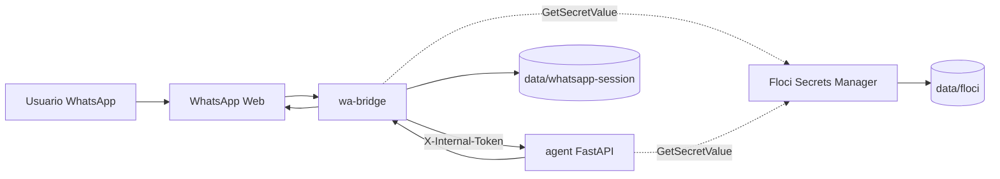
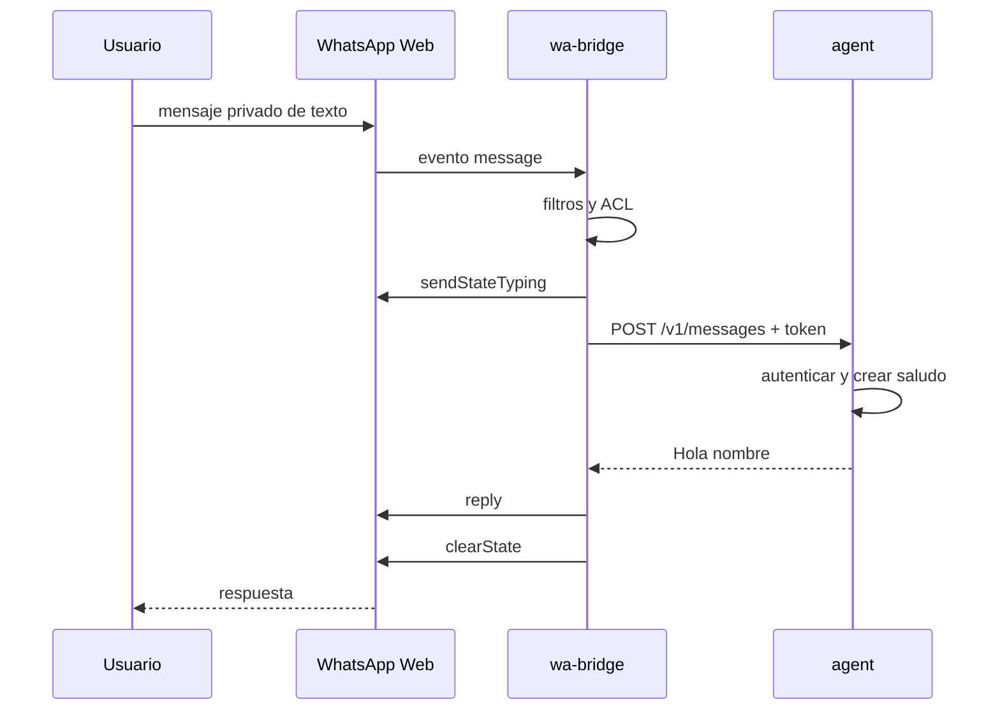
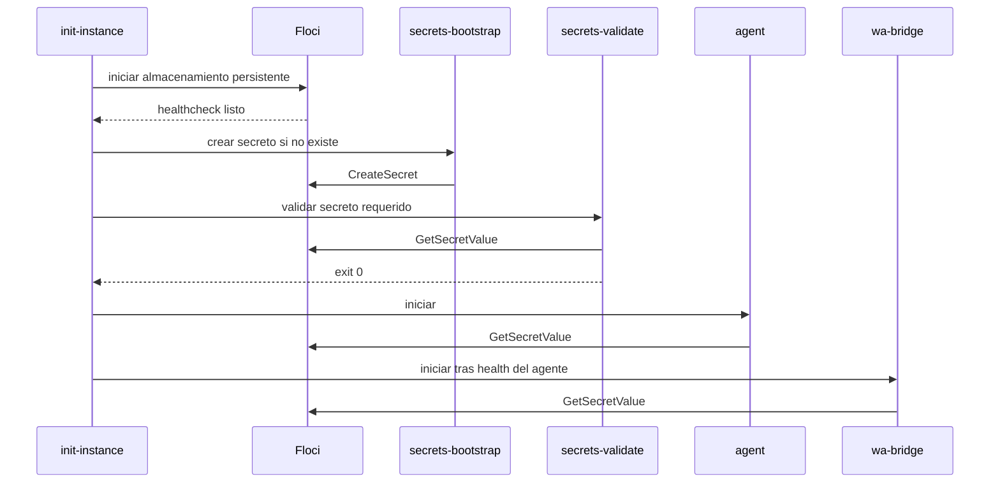

# Arquitectura de `wa-agent-core`

## Contenedores y fronteras

`floci` y `agent` pertenecen únicamente a la red privada `internal`. `wa-bridge`
pertenece a `internal` y `egress`: puede alcanzar WhatsApp Web, pero Floci y el agente
no quedan expuestos hacia internet ni hacia el host.

## Flujo de mensaje

Grupos, estados, mensajes propios, multimedia, tipos diferentes de `chat` y textos
vacíos se descartan antes de contactar al agente.

## Aprovisionamiento y arranque

El agente importa y crea FastAPI después de resolver el token. El bridge carga el
token antes de importar el cliente de WhatsApp. Cualquier fallo termina el proceso y
activa la política de reinicio; nunca existe fallback a un token plano.

Inicializacion y rotacion resuelven `SECRET_INTERNAL_API_TOKEN_NAME` con la misma
precedencia que los consumidores. Si no se configura, usan
`wa-agent-core/{INSTANCE_ID}/internal-api-token`.

## Persistencia

- `data/floci`: estado de Secrets Manager. No usar modo memoria en operación real.
- `data/whatsapp-session`: perfil Chromium y sesión de `LocalAuth`.
- `secrets/bootstrap.local.json`: entrada local `0600`, ignorada por Git y montada
  únicamente por la herramienta de bootstrap.

Los locks `SingletonLock`, `SingletonSocket` y `SingletonCookie` obsoletos se eliminan
antes de iniciar Chromium. No se eliminan cookies, IndexedDB ni datos de autenticación.

El QR se renderiza como PNG en `/tmp/wa-bridge.qr.png` con permisos `0600` y solo se
consulta mediante `scripts/show-qr.sh`. El script mantiene una copia local temporal,
la refresca sin publicar puertos y la elimina al terminar. El bridge elimina su copia
al alcanzar `ready`, ante fallo de autenticacion o al desconectarse. Los logs solo
indican que hay un QR disponible.

El cache Web requerido por `whatsapp-web.js` vive en `/tmp/wa-bridge-web-cache`. No
debe volver a una ruta relativa bajo `/app`, porque el bridge ejecuta como usuario no
root y fallaria despues de `authenticated` antes de emitir `ready`.

## Portabilidad

Node 20 y Python 3.12 usan imágenes Debian multi-arquitectura. En ARM64 se construye
Floci JVM 1.5.30 porque las imágenes nativas pueden exigir extensiones CPU ARM LSE no
presentes en algunas Raspberry. `FLOCI_IMAGE` permite usar otra imagen validada sin
cambiar Compose.

## Decisiones vigentes

- Una instancia por negocio.
- Autenticación interna mediante secreto compartido y comparación constante.
- Sin puertos públicos en el MVP.
- Floci solo se usa como Secrets Manager.
- Rotación con reinicio coordinado, sin ventana de doble token.
- El QR se entrega por un archivo efimero interno, nunca por logs.
- El QR y el mensaje real son verificaciones manuales.
