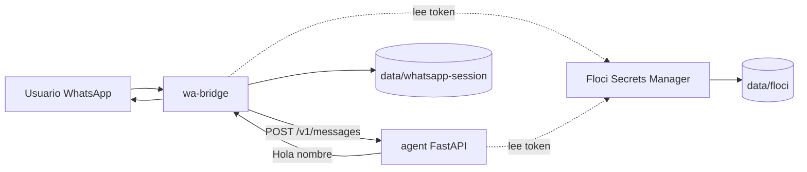

# Seguimiento de implementación de `wa-agent-core`

## Control del documento

- Proyecto: `wa-agent-core`
- Ruta objetivo: `/home/ubuntu/wa-agent-core`
- Inicio: 2026-07-15
- Responsable inicial: Codex
- Estado general: `EN PROGRESO`
- Repositorio: privado, local y sin remoto configurado

Este documento es la fuente oficial de seguimiento. Una tarea solo podrá marcarse
`COMPLETADA` cuando incluya evidencia verificable. Los estados permitidos son
`PENDIENTE`, `EN PROGRESO`, `BLOQUEADA` y `COMPLETADA`. Solo puede existir una tarea
`EN PROGRESO` dentro de cada fase.

## Objetivo

Construir una base mínima y reutilizable para que una persona escriba por WhatsApp,
el bridge entregue el mensaje a un agente HTTP autenticado y la respuesta `Hola
{nombre}` regrese al mismo chat. Los secretos internos se administrarán desde el
inicio mediante Floci Secrets Manager.

## Alcance inicial

- Una instancia aislada por negocio.
- Chats privados de texto.
- Bridge Node.js con `whatsapp-web.js` y Chromium.
- Agente Python con FastAPI.
- Autenticación interna con `X-Internal-Token`.
- Floci persistente como emulador local de AWS Secrets Manager.
- Compatibilidad con Linux `amd64` y Raspberry Pi `arm64` de 64 bits.
- Docker Compose como contrato de ejecución.

## Fuera de alcance

- Memoria conversacional, LLM y herramientas de negocio.
- SQS, Scheduler y demás APIs de Floci.
- Grupos, estados, audios, imágenes, documentos y llamadas.
- Multiempresa dentro de una misma instancia.
- Raspberry Pi o sistemas operativos de 32 bits.
- Despliegue en AWS real durante esta etapa.

## Restricciones y comportamiento que debe preservarse

- Ningún secreto real puede llegar a Git, imágenes, Compose, logs o documentación.
- Bridge y agente deben fallar de forma cerrada sin Floci o sin el secreto requerido.
- El puerto de Floci no se publicará al host.
- Los datos de Floci y la sesión de WhatsApp deben persistir fuera de los contenedores.
- El modo normal no puede regenerar ni sobrescribir el token existente.
- La animación de escritura debe detenerse siempre, incluso ante errores.
- No se añadirá una funcionalidad de negocio antes de cerrar esta base.

## Arquitectura objetivo



Servicios permanentes: `floci`, `agent` y `wa-bridge`. Servicios one-shot:
`secrets-bootstrap` y `secrets-validate`.

## Contrato HTTP inicial

```http
POST /v1/messages
X-Internal-Token: <secreto resuelto en tiempo de arranque>
Content-Type: application/json
```

Solicitud:

```json
{
  "message_id": "wamid-ejemplo",
  "chat_id": "573000000001@c.us",
  "sender_id": "573000000001@c.us",
  "sender_name": "Cliente",
  "text": "Hola",
  "timestamp": 1750000000
}
```

Respuesta:

```json
{"reply": "Hola Cliente"}
```

El nombre vacío produce `{"reply":"Hola"}`. Un token ausente o incorrecto produce
`401` sin detalles sensibles.

## Estrategia de secretos

- Nombre por defecto: `wa-agent-core/{INSTANCE_ID}/internal-api-token`.
- `.env` contiene identificadores y endpoints, nunca el valor del token.
- `secrets/bootstrap.local.json` se ignora en Git y exige permisos `0600`.
- El bootstrap es explícito, idempotente y no imprime valores.
- Node y Python resuelven el mismo secreto antes de cargar la aplicación.
- La rotación actualiza Floci y reinicia coordinadamente agente y bridge.
- Las credenciales AWS locales son valores dummy y no son una barrera de seguridad.
- Floci centraliza secretos, pero el cifrado de disco sigue siendo responsabilidad del host.

## Compatibilidad de despliegue

- `linux/amd64`: imagen Floci versionada y validada.
- `linux/arm64`: imagen JVM construida desde una versión fijada de Floci para evitar
  incompatibilidades ARM LSE.
- Las imágenes de Node y Python deben ser multi-arquitectura.
- `FLOCI_IMAGE` permite sustituir la imagen sin modificar Compose.
- El almacenamiento persistente es obligatorio en operación real.

## Resumen por fase

| Fase | Estado | Completadas | Total | Bloqueos |
| --- | --- | ---: | ---: | --- |
| 0. Creación y seguimiento | COMPLETADA | 2 | 2 | Ninguno |
| 1. Base del repositorio | COMPLETADA | 5 | 5 | Ninguno |
| 2. Floci y secretos | EN PROGRESO | 8 | 11 | Validación de imágenes y persistencia real |
| 3. Agente mínimo | PENDIENTE | 0 | 6 | Fase 2 |
| 4. Bridge WhatsApp | PENDIENTE | 0 | 9 | Fases 2 y 3 |
| 5. Integración y portabilidad | PENDIENTE | 0 | 9 | Fases 2–4 |
| 6. Validación y cierre | PENDIENTE | 0 | 11 | Fases 1–5 |

## Registro de tareas

### Fase 0 — Creación y seguimiento

| ID | Descripción | Estado | Dependencias | Inicio | Cierre | Responsable |
| --- | --- | --- | --- | --- | --- | --- |
| INIT-001 | Inicializar proyecto y Git en rama `main` | COMPLETADA | Ninguna | 2026-07-15 | 2026-07-15 | Codex |
| DOC-001 | Crear este documento y su primer commit exclusivo | COMPLETADA | INIT-001 | 2026-07-15 | 2026-07-15 | Codex |

### Fase 1 — Base del repositorio

| ID | Descripción | Estado | Dependencias |
| --- | --- | --- | --- |
| BASE-001 | Crear estructura de bridge, agente, scripts, secretos, pruebas y datos | COMPLETADA | DOC-001 |
| BASE-002 | Configurar `.gitignore` para secretos, sesiones y datos | COMPLETADA | BASE-001 |
| BASE-003 | Crear `.env.example` sin valores sensibles | COMPLETADA | BASE-001 |
| BASE-004 | Fijar versiones de runtimes y dependencias | COMPLETADA | BASE-001 |
| BASE-005 | Crear y validar Compose inicial | COMPLETADA | BASE-002–004 |

### Fase 2 — Floci y Secret Manager

| ID | Descripción | Estado | Dependencias |
| --- | --- | --- | --- |
| FLOCI-001 | Configurar Floci persistente y aislado | PENDIENTE | BASE-005 |
| FLOCI-002 | Detectar `amd64` o `arm64` | COMPLETADA | BASE-001 |
| FLOCI-003 | Usar imagen versionada en `amd64` | PENDIENTE | FLOCI-002 |
| FLOCI-004 | Construir variante JVM para `arm64` | PENDIENTE | FLOCI-002 |
| SECRET-001 | Implementar cliente Secrets Manager Node | COMPLETADA | FLOCI-001 |
| SECRET-002 | Implementar cliente Secrets Manager Python | COMPLETADA | FLOCI-001 |
| SECRET-003 | Crear bootstrap seguro e idempotente | COMPLETADA | SECRET-002 |
| SECRET-004 | Crear validación fail-closed | COMPLETADA | SECRET-002 |
| SECRET-005 | Generar token sin sobrescribir uno existente | COMPLETADA | SECRET-003 |
| SECRET-006 | Implementar rotación coordinada | COMPLETADA | SECRET-001–005 |
| SECRET-007 | Auditar que no se expongan secretos | COMPLETADA | SECRET-001–006 |

### Fase 3 — Agente mínimo

| ID | Descripción | Estado | Dependencias |
| --- | --- | --- | --- |
| AGENT-001 | Crear FastAPI y healthcheck | PENDIENTE | BASE-004 |
| AGENT-002 | Autenticar con `X-Internal-Token` | PENDIENTE | SECRET-002 |
| AGENT-003 | Implementar `POST /v1/messages` | PENDIENTE | AGENT-001–002 |
| AGENT-004 | Responder saludo personalizado o fallback | PENDIENTE | AGENT-003 |
| AGENT-005 | Probar autenticación, validación y saludo | PENDIENTE | AGENT-001–004 |
| AGENT-006 | Impedir arranque sin secreto | PENDIENTE | SECRET-004, AGENT-002 |

### Fase 4 — Bridge WhatsApp

| ID | Descripción | Estado | Dependencias |
| --- | --- | --- | --- |
| BRIDGE-001 | Configurar `whatsapp-web.js` y Chromium | PENDIENTE | BASE-004 |
| BRIDGE-002 | Persistir sesión de WhatsApp | PENDIENTE | BRIDGE-001 |
| BRIDGE-003 | Filtrar mensajes no soportados | PENDIENTE | BRIDGE-001 |
| BRIDGE-004 | Obtener JID y nombre visible | PENDIENTE | BRIDGE-003 |
| BRIDGE-005 | Consumir agente con token de Floci | PENDIENTE | SECRET-001, AGENT-003 |
| BRIDGE-006 | Manejar timeout y fallos | PENDIENTE | BRIDGE-005 |
| BRIDGE-007 | Controlar animación de escritura | PENDIENTE | BRIDGE-005 |
| BRIDGE-008 | Implementar ACL configurable | PENDIENTE | BRIDGE-003 |
| BRIDGE-009 | Añadir pruebas aisladas | PENDIENTE | BRIDGE-003–008 |

### Fase 5 — Integración y portabilidad

| ID | Descripción | Estado | Dependencias |
| --- | --- | --- | --- |
| WIRE-001 | Ordenar Floci, validación, agente y bridge | PENDIENTE | Fases 2–4 |
| WIRE-002 | Crear inicializador idempotente | PENDIENTE | SECRET-003–005 |
| WIRE-003 | Configurar healthchecks y reinicios | PENDIENTE | WIRE-001 |
| PORTABLE-001 | Validar `amd64` | PENDIENTE | WIRE-001–003 |
| PORTABLE-002 | Validar Raspberry `arm64` | PENDIENTE | FLOCI-004, WIRE-001–003 |
| PORTABLE-003 | Configurar límites de recursos | PENDIENTE | WIRE-001 |
| PORTABLE-004 | Documentar systemd opcional | PENDIENTE | WIRE-003 |
| DATA-001 | Validar persistencia independiente | PENDIENTE | FLOCI-001, BRIDGE-002 |
| DATA-002 | Documentar backup y restauración | PENDIENTE | DATA-001 |

### Fase 6 — Validación y cierre

| ID | Descripción | Estado | Dependencias |
| --- | --- | --- | --- |
| TEST-001 | Ejecutar pruebas Node | PENDIENTE | BRIDGE-009 |
| TEST-002 | Ejecutar pruebas Python | PENDIENTE | AGENT-005, SECRET-002–004 |
| TEST-003 | Validar Docker Compose | PENDIENTE | WIRE-003 |
| TEST-004 | Comprobar bootstrap y persistencia | PENDIENTE | SECRET-003–005 |
| TEST-005 | Ejecutar smoke test por WhatsApp | PENDIENTE | TEST-001–004 |
| TEST-006 | Comprobar rotación y rechazo del token anterior | PENDIENTE | SECRET-006 |
| SEC-001 | Revisar archivos sensibles y logs | PENDIENTE | Todas las fases |
| DOC-002 | Crear README operativo | PENDIENTE | Fases 1–5 |
| DOC-003 | Crear arquitectura y diagramas | PENDIENTE | Fases 1–5 |
| DOC-004 | Crear y mantener `CHANGELOG.md` para código | PENDIENTE | Primer cambio de código |
| DOC-005 | Cerrar seguimiento con evidencias | PENDIENTE | TEST-001–006, SEC-001, DOC-002–004 |

## Criterios de aceptación finales

- El primer commit contiene exclusivamente este documento.
- Bridge y agente obtienen el token únicamente desde Floci.
- Sin Floci o sin secreto, el sistema no queda listo para recibir mensajes.
- Floci y la sesión de WhatsApp sobreviven a recreaciones de contenedores.
- Un mensaje privado genera `Hola {nombre}` y muestra la animación de escritura.
- La base es desplegable en Linux `amd64` y Raspberry `arm64`.
- No se incorporan capacidades fuera del alcance inicial.
- Cada tarea completada registra evidencia, archivos, pruebas y commit.

## Evidencia por tarea completada

### INIT-001

- Comportamiento preservado: proyecto independiente, sin historial ni remoto heredados.
- Archivos modificados: ninguno; se creó el repositorio y `docs/`.
- Pruebas: no aplica.
- Comandos: `git init -b main`.
- Resultado: repositorio inicializado en rama `main`.
- Commit: incluido junto con DOC-001 por no producir archivos propios.
- Observaciones: el repositorio se prepara temporalmente en un área editable y se
  trasladará íntegramente a la ruta objetivo conservando `.git`.

### DOC-001

- Comportamiento preservado: el primer cambio es exclusivamente documental.
- Archivos modificados: `docs/seguimiento_implementacion.md`.
- Pruebas: revisión del diff y búsqueda de patrones sensibles.
- Comandos: `git status --short`, `git diff --no-index`, `rg`.
- Resultado: documento completo y sin valores sensibles detectados.
- Commit: este primer commit; el hash se registrará durante el cierre documental.
- Observaciones: `CHANGELOG.md` no se crea en esta fase.

### BASE-001 a BASE-005

- Inicio y cierre: 2026-07-15.
- Responsable: Codex.
- Comportamiento preservado: repositorio independiente, sin secretos ni código de
  negocio; servicios aislados en una red interna.
- Archivos modificados: `.gitignore`, `.dockerignore`, `.env.example`,
  `docker-compose.yaml`, manifiestos y Dockerfiles de `agent/` y `bridge/`, más
  directorios persistentes y ejemplos seguros.
- Pruebas: validación estructural de Compose y búsqueda de patrones sensibles.
- Comandos: `docker compose config --quiet`, `rg`, `git status --short`.
- Resultado: Compose válido; no se detectaron valores sensibles.
- Commit: commit de estructura base; hash pendiente de registro al cierre.
- Observaciones: las imágenes aún no se construyen porque el código se incorpora en
  las fases siguientes.

### FLOCI-002 y SECRET-001 a SECRET-007

- Inicio y cierre: 2026-07-15.
- Responsable: Codex.
- Comportamiento preservado: el token no tiene fallback a variables planas; el
  bootstrap normal conserva secretos existentes y la rotación exige modo explícito.
- Archivos modificados: providers Node/Python, bootstrap, validación, scripts de
  preparación/inicialización/rotación, tests y `CHANGELOG.md`.
- Pruebas: 8 pruebas Python, 3 pruebas Node, validación de sintaxis shell,
  compilación Python y configuración Compose.
- Comandos: `pytest -q`, `bash -n`, `python3 -m compileall`,
  `docker compose config --quiet`.
- Resultado: 8 pruebas Python y 3 pruebas Node OK; verificaciones estáticas OK.
- Commit: commit de Secrets Manager; hash pendiente de registro al cierre.
- Observaciones: FLOCI-001, FLOCI-003 y FLOCI-004 permanecen pendientes hasta
  comprobar el contenedor y su persistencia real.

## Registro de comandos y resultados

| Fecha | Tarea | Comando | Resultado |
| --- | --- | --- | --- |
| 2026-07-15 | INIT-001 | `git init -b main` | OK |
| 2026-07-15 | DOC-001 | `git status`, revisión de diff y búsqueda sensible | OK |
| 2026-07-15 | BASE-001–005 | `docker compose config --quiet` | OK |
| 2026-07-15 | BASE-002–003 | Búsqueda de patrones sensibles con `rg` | OK |
| 2026-07-15 | SECRET-002–005 | `pytest -q /app/tests` | 8 OK |
| 2026-07-15 | SECRET-001 | `node --test runtime-secrets.test.js` | 3 OK |
| 2026-07-15 | SECRET-001–006 | `bash -n` y `python3 -m compileall` | OK |

## Decisiones arquitectónicas

| ID | Decisión | Motivo |
| --- | --- | --- |
| ADR-001 | Una instancia por negocio | Aislamiento simple de sesión, secretos y operación |
| ADR-002 | Floci obligatorio y fail-closed | Evitar secretos planos y arranques inseguros |
| ADR-003 | Solo Secrets Manager de Floci | Mantener mínimo el alcance inicial |
| ADR-004 | FastAPI + Node bridge | Separar canal WhatsApp de la lógica del agente |
| ADR-005 | `amd64` y `arm64` de 64 bits | Cubrir VPS y Raspberry sin mantener runtimes de 32 bits |
| ADR-006 | Datos persistentes fuera de imágenes | Conservar sesión y secretos al recrear contenedores |

## Deuda y limitaciones pendientes

- La disponibilidad real de imágenes Floci para cada arquitectura debe validarse.
- El smoke test por WhatsApp requiere vinculación manual mediante QR.
- Floci local no garantiza por sí solo cifrado en reposo.
- No hay alta disponibilidad ni rotación sin reinicio en esta versión.

## Cierre del proyecto

- Fecha: pendiente.
- Commit final: pendiente.
- Resultado global: pendiente.
- Limitaciones residuales: pendiente.
